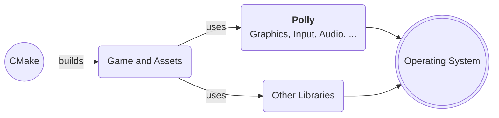
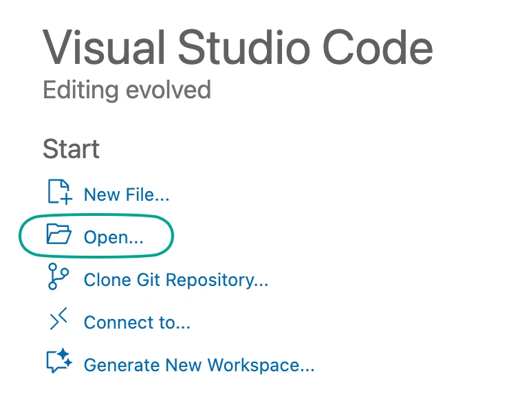

<h1 class="main-title" style="text-align: center">Polly</h1>

<p class="sub-title center-text" style="font-size: 120%">Minimalistic 2D C++ Game Framework</p>

{ width=130 .align-center .margin-top-bottom-medium }

<p class="center-text">
Polly is a framework that makes it easy to get started with C++ 2D game development using a clean, modern API, for beginners and experts alike. It provides every audiovisual aspect necessary to comfortably make a 2D game using a code-only approach.
</p>

<!--
<div class="centering-container">
    <a class="docmd-button"  href="#getting-started">Get Started</a>
</div>
-->

{ .align-center width=800 }

## Who is this for?

Polly is designed to be a "bring your own tools" game framework, not an engine.
It's for those who want to develop a 2D game using a flexible and portable high-performance
language without any of the overhead that comes with a classic game engine.

By leveraging modern C++ and a custom, simplified standard library, it provides an easy to use
framework that just gets out of your way. Polly produces minimal executables that run without any
additional runtime or garbage collector.

There is no map editor, no sprite editor and no strict entity architecture. Just your code and idea.



## Do I need to know C++ and CMake?

Ideally, you should at least have some beginner-level experience with (modern) C++. This will help you follow
the documentation more easily. On the other hand, you do **not** need to write any CMake in order to make a game.

Polly takes care of the majority of the CMake code. You only need an editor or IDE that understands CMake.

---

??? info "Platform and Compiler Support"

    ## Platform Support

    Polly is able to run on the following platforms:

    - Windows x64 & ARM64
    - Linux x64 & ARM64 (Ubuntu, Fedora, Debian)
    - Linux RISC-V (tested with StarFive VisionFive board, Debian)
    - macOS 13+ (released in 2022)
    - iOS 16+ (released in 2022)
    - Android 8.0+ (all ABIs)[^1]
    - Web[^1]

    [^1]: Android and Web is technically supported, but work is in progress to make it available in the game template and the out-of-the-box experience more polished.

    ## Compiler Support

    Polly is tested and can be built with the following toolchains:

    - Visual Studio 2022 and later (MSVC)
    - GCC 11.4 and later
    - Clang 17 and later
    - Xcode 13 and later

## Getting Started

You can use Polly with your preferred editor / IDE. For a quick and easy start, CLion or Visual Studio is recommended.

=== ":simple-clion: CLion"

    !!! note inline end
        CLion requires a Jetbrains account, including the free (for non-commercial) version.

    - [x] Simply install [CLion](https://www.jetbrains.com/clion/){target="_blank"} and follow its instructions.

        CLion should set up a C++ toolchain automatically depending on your OS.

=== ":material-microsoft-visual-studio: Visual Studio"
    
    !!! note inline end
        Visual Studio is only available on Windows. For cross-platform development, CLion or VS Code is recommended.

    - [x] Install [Visual Studio](https://visualstudio.microsoft.com/){target="_blank"} and during installation enable
    the C++ and Python development packages.

=== ":material-microsoft-visual-studio-code: VS Code"

    === ":material-microsoft-windows: Windows"

        - [x] Install [VS Code](https://code.visualstudio.com/){target="_blank"}
        - [x] If you don't have Visual Studio installed, install the [Visual Studio Build Tools for C++](https://aka.ms/vs/17/release/vs_BuildTools.exe). Otherwise, skip this step.

    === ":material-apple: macOS"

        - [x] Install [Homebrew](https://github.com/Homebrew/brew/releases){target="_blank"}
        
        - [x] Install the Xcode Command Line Tools:
   
              ```sh
              xcode-select --install
              ```
   
              Then install VS Code, Git and CMake:
   
              ```sh
              brew install visual-studio-code git cmake
              ```

    === ":material-linux: Linux"

        - [x] Install VS Code either [directly](https://code.visualstudio.com/){target="_blank"} **or** via your package manager
        - [x] Install Git and CMake via your package manager

    #### :material-cube: VS Code Extensions

    The following extensions are recommended:

    - [C++ Extension Pack](https://marketplace.visualstudio.com/items?itemName=ms-vscode.cpptools-extension-pack) &ndash; Contains CMake and C++ tools and language engines (IntelliSense)
    - [Output Colorizer](https://marketplace.visualstudio.com/items?itemName=IBM.output-colorizer) &ndash; Improves the readability of compiler messages

=== ":simple-qt: Qt Creator"

    - [x] Install Qt Creator either [directly](https://www.qt.io/offline-installers) **or** via your package manager.
        - For Linux, Qt Creator is also available as a [Flatpak](https://flathub.org/en/apps/io.qt.QtCreator)

=== ":simple-xcode: Xcode"

    - [x] Install [Homebrew](https://github.com/Homebrew/brew/releases)
    - [x] Install [Xcode](https://apps.apple.com/de/app/xcode/id497799835)
    - [x] Install Git and CMake:
   
          ```sh
          brew install visual-studio-code git cmake
          ```

---

??? abstract "Install Dependencies (:material-linux: Linux only)"

    On Linux, development libraries are required, such as for X11, Wayland and ALSA.

    === ":material-ubuntu: Ubuntu and similar (apt)"

        ```sh
        sudo apt install build-essential git make binutils pkg-config cmake ninja-build clang-format \
                         gnome-desktop-testing libasound2-dev libpulse-dev \
                         libaudio-dev libjack-dev libsndio-dev libx11-dev libxext-dev \
                         libxrandr-dev libxcursor-dev libxfixes-dev libxi-dev libxss-dev libxtst-dev \
                         libxkbcommon-dev libdrm-dev libgbm-dev libgl1-mesa-dev libgles2-mesa-dev \
                         libegl1-mesa-dev libdbus-1-dev libibus-1.0-dev libudev-dev
        ```

    === ":material-fedora: Fedora and similar (dnf)"

        ```sh
        sudo dnf install gcc git-core make cmake ninja-build gcc-c++ pkg-config clang-tools-extra \
                         alsa-lib-devel pulseaudio-libs-devel nas-devel pipewire-devel \
                         libX11-devel libXext-devel libXrandr-devel libXcursor-devel libXfixes-devel \
                         libXi-devel libXScrnSaver-devel dbus-devel ibus-devel \
                         systemd-devel mesa-libGL-devel libxkbcommon-devel mesa-libGLES-devel \
                         mesa-libEGL-devel vulkan-devel wayland-devel wayland-protocols-devel \
                         libdrm-devel mesa-libgbm-devel libdecor-devel \
                         pipewire-jack-audio-connection-kit-devel
        ```

If you have issues with installing some packages, or see some missing, please [report them](https://github.com/cdervis/Polly/issues).

## Next Steps

- [x] **Download and unpack the [Game Template](https://github.com/cdervis/Polly/releases/download/v0.9.4/GameTemplate.zip)**

- [x] Open the Game Template in your preferred IDE.

    === ":simple-clion: CLion"
    
        {.align-center .margin-top-medium width=400}
    
    === ":material-microsoft-visual-studio: Visual Studio"
    
        {.align-center .margin-top-medium width=400}
    
    === ":material-microsoft-visual-studio-code: VS Code"

        {.align-center .margin-top-medium width=300}

    === ":simple-qt: Qt Creator"
    
        {.align-center .margin-top-medium width=700}
    
    === ":simple-xcode: Xcode"
    
        - [x] Generate an Xcode project for your game:
            ```sh
            cmake -B build/xcode -G Xcode
            ```
        
        - [x] Open the generated .xcodeproj file via Finder or command line:
            ```sh
            open build/xcode/MyGame.xcodeproj
            ```
    
- [x] Run the game

---

You should now see the game running:


That's it! We're now ready to see [how a game is structured](game-structure.md).

