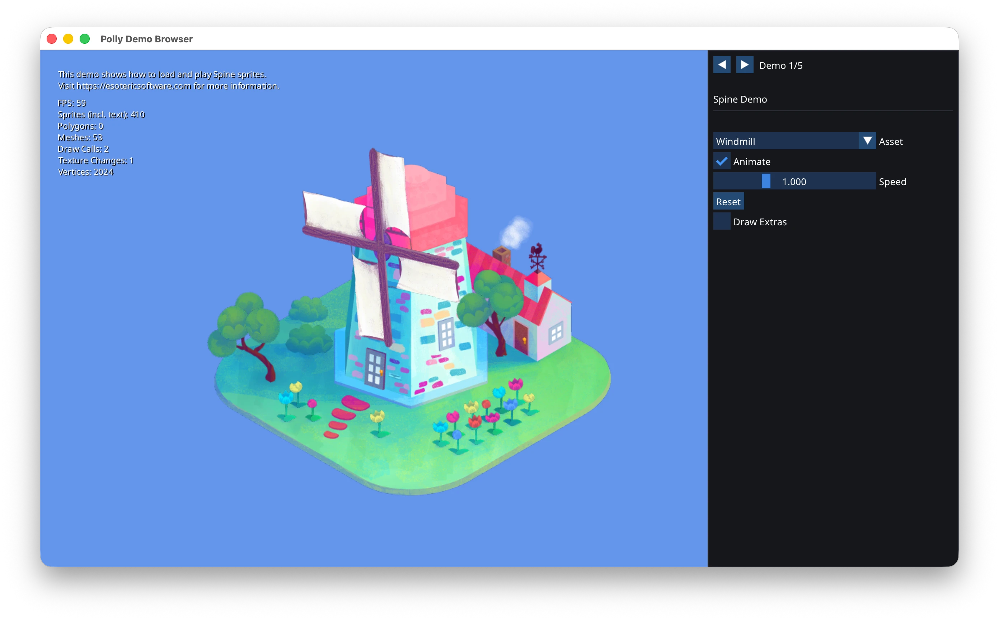

<div class="title-block" style="text-align: center;" align="center">

# Polly

<p></p>

Minimal 2D Game Framework for C++

[](https://polly2d.org)
[](#getting-started)
[](https://github.com/cdervis/Polly/blob/main/LICENSE.md)

[](https://github.com/cdervis/Polly/actions/workflows/build-windows.yml)
[](https://github.com/cdervis/Polly/actions/workflows/build-linux.yml)
[](https://github.com/cdervis/Polly/actions/workflows/build-macos.yml)

</div>

## Introduction

Polly makes it easy to get started with C++ 2D game development using a clean, modern API.

It's **not** a game engine and doesn't provide any kind of visual editor.
Instead, it lets you define your game architecture however you desire it, and gives you all the necessary tools to do so.

In short, it provides every audiovisual aspect necessary to comfortably make a 2D game using a pure C++, code-only approach. 



> [!NOTE]  
> Polly is currently in early development. Some things might be broken, not documented and many things change frequently.
> Feedback is very much appreciated.

```cpp
// Minimal example
#include "Polly.hpp"

struct MyGame final : Game
{
    Image myImage   = Image("logo.png");
    float animation = 0.0f;

    List<Sound> sounds = {
        Sound(SfxrSoundPreset::Coin, 218309),
        Sound(SfxrSoundPreset::Explosion, 5838292),
        Sound(SfxrSoundPreset::Laser, 2873),
    };

    // Update the game's logic.
    void update(GameTime time) override
    {
        animation = sin(time.total() * 3) * 100;
    }

    // Draw the game's visuals.
    void draw(Painter painter) override
    {
        auto imgPos = (window().sizePx() - myImage.size()) / 2 + Vec2(animation, 0);
        painter.drawSprite(myImage, imgPos, white);
    }

    // Perform ImGui stuff.
    void onImGui(ImGui& imgui) override
    {
        if (imgui.button("Click me!"))
        {
            logInfo("Button was clicked!");
            audio().playOnce(*randomItem(sounds));
        }
    }
};
```

### Features

- **Cross-Platform**: Runs on multiple platforms, including Windows, macOS, Linux, Android and iOS.

- **Free and Open Source**: GPLv3 for the framework itself, MIT for games produced with it, with no royalties attached.

- **Modern C++**: Improved C++ types and containers, providing an ergonomic API and safety guarantees by default.

- **App Framework**: Based on an optimized SDL fork, with easy-to-use input, window and event handling.

- **Modern 2D Renderer**: Efficient 2D rendering using the platform's native graphics API, such as Vulkan and Metal.

- **Audio**: Easy-to-use audio API, including faders and channels for playback control.

- **Custom Shaders**: Simple and safe shading language that compiles to native shading languages.

- **Content Management**: Load common formats such as PNG, JPG, WAV, MP3, FLAC and much more. Assets are automatically packed to an efficient binary archive.

- **Particle Systems**: Flexible 2D particle systems, customizable behaviors via emitters, modifiers and shapes.

- **Dear ImGui**: C++ idiomatic [Dear ImGui](https://github.com/ocornut/imgui) integration  for rapid prototyping and UI.

- **Spine Integration**: [Spine](https://esotericsoftware.com/) integration for powerful physics-based skeletal 2D animations.

---

### Getting started

Polly is designed to be very easy to start with.
Simply grab the latest [Game Template](https://github.com/cdervis/Polly/releases) and open it in your C++ IDE or editor of choice.

**Note** that the entire build process is CMake-based, your IDE therefore requires proper CMake support.

If you're on Windows, [Visual Studio](https://visualstudio.com) or [CLion](https://www.jetbrains.com/clion/) is recommended, whichever you prefer.
Visual Studio Community is free for individual developers and can be used to produce free or paid games. CLion is free for non-commercial projects.

#### Requirements

<details>
<summary>Windows :window:</summary>

Please ensure that [Git](https://git-scm.com/downloads/win) and [Python 3](https://www.python.org/downloads/windows/) are installed.

</details>

<details>
<summary>macOS </summary>
    
Please ensure that [Homebrew](https://github.com/Homebrew/brew/releases) is installed.

Then install Xcode via the [App Store](https://apps.apple.com/us/app/xcode/id497799835?mt=12) **or** via the command line:
```sh
xcode-select --install
```

Then install Git and CMake:
```sh
brew install git cmake
```

If you're **not** using CLion or another IDE / editor, you can generate an Xcode project for your game:
```sh
cmake -B build/xcode -G Xcode
open build/xcode/MyGame.xcodeproj
```

</details>

<details>
<summary>Linux :penguin:</summary>

On Linux, development libraries for e.g. X11, Wayland and ALSA are required.

##### Ubuntu and similar:
```sh
sudo apt install build-essential git make binutils pkg-config cmake ninja-build clang-format \
                 gnome-desktop-testing libasound2-dev libpulse-dev \
                 libaudio-dev libjack-dev libsndio-dev libx11-dev libxext-dev \
                 libxrandr-dev libxcursor-dev libxfixes-dev libxi-dev libxss-dev libxtst-dev \
                 libxkbcommon-dev libdrm-dev libgbm-dev libgl1-mesa-dev libgles2-mesa-dev \
                 libegl1-mesa-dev libdbus-1-dev libibus-1.0-dev libudev-dev
```

##### Fedora and similar:
```sh
sudo yum install gcc git-core make cmake ninja-build gcc-c++ pkg-config clang-tools-extra \
                 alsa-lib-devel pulseaudio-libs-devel nas-devel pipewire-devel \
                 libX11-devel libXext-devel libXrandr-devel libXcursor-devel libXfixes-devel \
                 libXi-devel libXScrnSaver-devel dbus-devel ibus-devel \
                 systemd-devel mesa-libGL-devel libxkbcommon-devel mesa-libGLES-devel \
                 mesa-libEGL-devel vulkan-devel wayland-devel wayland-protocols-devel \
                 libdrm-devel mesa-libgbm-devel libdecor-devel \
                 pipewire-jack-audio-connection-kit-devel \
```

</details>

#### Starting the game

To start building and running your game, just open the game template folder in your IDE and hit run.

<details>
<summary>Example for Visual Studio:</summary>
    


</details>

### Documentation

Documentation is currently being worked on, alongside an API reference.

In the meantime, you're welcome to explore the code of the [Demo Browser](https://github.com/cdervis/Polly/tree/main/Apps/DemoBrowser)
and the [Space Shooter Demo](https://github.com/cdervis/Polly/tree/main/Apps/SpaceShooter).

### Platform support

Polly is able to run on the following platforms:

- Windows x64 & ARM64
- Linux x64 & ARM64 (Ubuntu, Fedora, Debian)
- Linux RISC-V (StarFive VisionFive board, Debian)
- macOS 13 Ventura (released in 2022)
- iOS 16 (released in 2022)
- Android (all ABIs)

Porting Polly to the web is trivial, but will only be done if there's enough interest.

### Compiler requirements

Polly was tested and can be built with the following toolchains:
- Visual Studio 2022 (MSVC)
- GCC 11.4+
- Clang 17+
- Xcode 13+

### Contributing to Polly

Contributions are always welcome, be it in the form of feedback, bug reports or code changes.

To learn more about how to contribute, please visit [Contributing](CONTRIBUTING.md).

